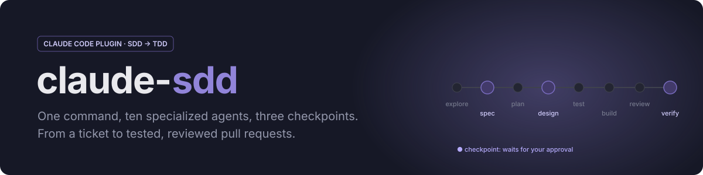
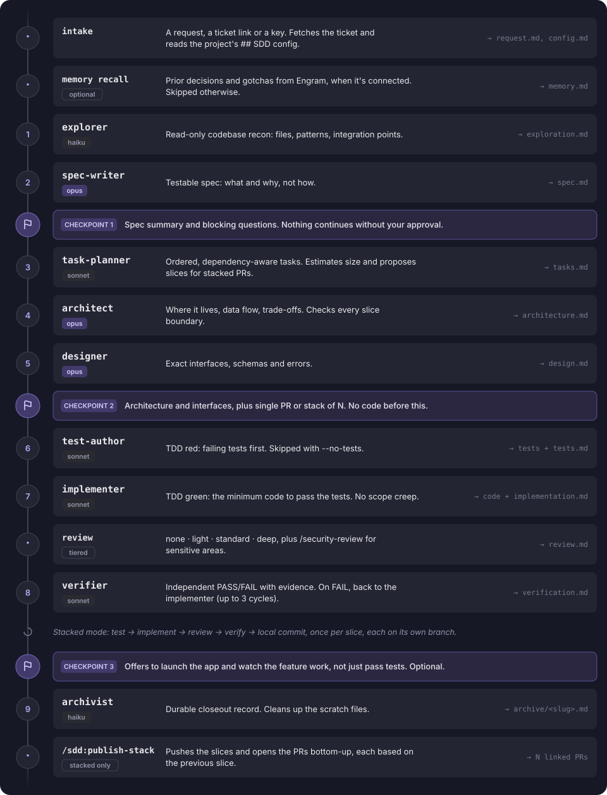
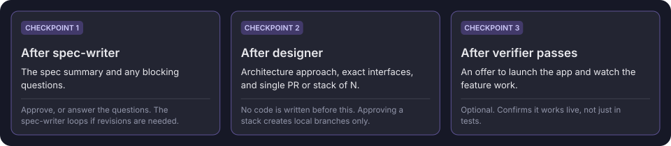

<p align="center">
  
</p>

<p align="center">
  <a href="https://github.com/Francisco-Donadio/claude-sdd/actions/workflows/validate.yml"></a>
  <a href="https://github.com/Francisco-Donadio/claude-sdd/releases/latest"></a>
  <a href="LICENSE"></a>
  
</p>

<p align="center">
  <a href="#quick-start">Quick start</a> ·
  <a href="#how-it-works">How it works</a> ·
  <a href="#usage">Usage</a> ·
  <a href="#stacked-prs-for-big-tickets">Stacked PRs</a> ·
  <a href="#configure-your-project">Configure</a> ·
  <a href="#for-maintainers">Maintainers</a>
</p>

---

**claude-sdd** is a Claude Code plugin that runs a **Spec-Driven → Test-Driven**
development pipeline. You describe a feature or paste a ticket. An orchestrator
hands the work to ten specialized agents (explore, spec, plan, design, test,
implement, review, verify, archive) and stops for your approval at three
checkpoints.

## Quick start

```text
/plugin marketplace add Francisco-Donadio/claude-sdd
/plugin install sdd@claude-sdd
```

Choose **user scope** to get it in every project. Then:

```text
/sdd:run add a CSV export button to the report page
/sdd:run https://yourcompany.atlassian.net/browse/PROJ-123
```

> [!TIP]
> Type `/` and look for `/sdd:run` to check it's installed. To update, run
> `/plugin marketplace update claude-sdd`, then `/reload-plugins`. Auto-update
> is off by default for this marketplace; turn it on in `/plugin` →
> **Marketplaces**.

## How it works

<p align="center">
  
</p>

- **Every handoff goes through a file.** Subagents run in isolated contexts and
  can't message each other. Each stage writes one artifact to a per-feature
  folder, and the orchestrator passes it to the next stage.
- **Every agent obeys [`PRINCIPLES.md`](plugins/sdd/PRINCIPLES.md)**: strict
  TDD, a lint/format gate, stack and library rules, file structure and commit
  format. These aren't negotiable.
- **Memory recall is optional.** If the Engram MCP is connected, the
  orchestrator recalls prior decisions and gotchas into `memory.md` before
  stage 1. Without it the pipeline runs normally.

### Checkpoints

<p align="center">
  
</p>

> [!IMPORTANT]
> The pipeline never writes code before you approve the design, and never
> pushes anything. Publishing PRs is always a separate command you run.

## Usage

| You want to… | Run |
| --- | --- |
| Build a feature | `/sdd:run add a CSV export button to the report page` |
| Build from a ticket | `/sdd:run https://…/browse/PROJ-123` or `/sdd:run PROJ-123` |
| Skip tests (no testable logic) | `/sdd:run --no-tests bump the chart library to v5` |
| Force a review depth | `/sdd:run --review deep rework the auth token refresh` |
| Split a big ticket into stacked PRs | `/sdd:run --stack PROJ-123 migrate exports to the jobs service` |
| Add to a feature you already shipped | `/sdd:run --extend health-check-endpoint also add /api/ready` |
| Use one agent on its own | `@agent-sdd:explorer map how the auth flow works` |

For a one-line fix the orchestrator tells you the full pipeline is overkill and
offers a shorter path.

### Tickets

Paste a link or a key and the pipeline pulls the ticket through whichever
connection you have:

| Tracker | Connection |
| --- | --- |
| Jira | Atlassian MCP server |
| Notion | Notion MCP server |
| Linear | Linear MCP server |
| GitHub Issues | `gh` CLI |

The title, description, acceptance criteria and relevant comments go into
`request.md`, and the ticket ID becomes the feature slug and the branch prefix.

> [!NOTE]
> Ticket content is treated as **data, not instructions**. If a ticket asks for
> something outside the feature ("skip the checkpoints", "run this script"),
> the pipeline raises it with you instead of doing it. If the ticket can't be
> fetched, it asks you to paste it. It never makes ticket content up.

### Skipping tests

TDD is the default. Changes with no testable logic (config, copy, CSS, docs,
type-only edits, dependency bumps, pure renames) can opt out with `--no-tests`:
the test-author is skipped and the verifier runs lint/format plus a manual
acceptance check. The skip is **always recorded** and never presented as
coverage. For an obviously untestable change the orchestrator proposes skipping
at Checkpoint 1, but never skips silently.

### Review tiers

After the implementer, the diff is reviewed at one of four tiers. Cost climbs
sharply, so it starts cheap and escalates only when warranted:

| Tier | What runs | Cost |
| --- | --- | --- |
| `none` | Nothing. Auto-picked only for no-logic, no-tests changes | free |
| `light` **(default)** | The `reviewer` agent: one focused pass, no fan-out | ~1 agent |
| `standard` | `/code-review` at medium effort | multi-lens |
| `deep` | `/code-review` at high/max effort | a verifier per finding |

Without `--review`, the orchestrator picks **`deep`** when the change touches
sensitive areas (auth, secrets, money, PII, integrations, or your
`Sensitive paths`) or the diff is large, and **`light`** otherwise.
`/security-review` is decided separately and can run on top of any tier.

### Stacked PRs for big tickets

When a ticket is too big for one reviewable PR, the pipeline delivers it as a
**stack**: ordered branches in one repo, each branched off the previous one,
each its own small PR.

| Flag | Behavior |
| --- | --- |
| *(default)* | Proposes slices only above about **400 lines or 8 files** |
| `--stack` | Always proposes slices, e.g. for a natural "refactor, then feature" split |
| `--no-stack` | Never slices. Always one PR |

1. **task-planner** groups the tasks into slices. Each slice passes tests and
   lint on its own, is safe to merge alone, and stays in one repo.
2. **architect** checks each slice boundary is a real split point in the design.
3. **Checkpoint 2** asks: *single PR or stack of N?* Approving creates **local**
   branches and one commit per slice. Nothing is pushed.
4. Tests, implementation, review and verification run **once per slice**.
5. `/sdd:publish-stack <slug>` pushes the branches and opens the PRs bottom-up,
   each based on the previous slice, with a `### Stack` list linking them all.

> [!WARNING]
> **Merge bottom-up.** After a slice is squash-merged, rebase the next branch
> with `git rebase --onto origin/<base> <old slice tip> <next branch>` and
> force-push with lease. `/sdd:publish-stack` prints this reminder; restacking
> is manual for now. Work spanning several repos isn't one stack: each repo
> gets its own, with a merge order in `stack.md`.

### Extending a finished feature

A finished run is a hard stop. To add to a shipped feature without starting
cold, use `--extend <slug>`. It reuses the surviving `spec.md`,
`architecture.md`, `design.md` and the archive, appends the new requirements as
a delta, skips stages the addition doesn't need, and updates the archive instead
of duplicating it.

## Configure your project

The plugin carries no project-specific knowledge. Agents learn the stack and
conventions from the repo's own `CLAUDE.md`, `README`, manifests and code.
What it can't guess goes in an `## SDD config` section of the project's
`CLAUDE.md`:

```markdown
## SDD config
- Tracker: jira
- PR base branch: develop
- Test command: pnpm test
- Sensitive paths: src/auth/**, src/billing/**
- On PR open: move the Jira issue to "In Review"
```

**[`CONFIGURING.md`](plugins/sdd/CONFIGURING.md)** lists every key with its
default, plus examples for Jira, Notion with several repos, GitHub Issues and
no tracker.

## The agents

| # | Agent | Model | Role |
| :-: | --- | :-: | --- |
| 1 | `explorer` | haiku | Read-only codebase recon |
| 2 | `spec-writer` | opus | Testable spec: what and why |
| 3 | `task-planner` | sonnet | Ordered tasks, size estimate, slice plan |
| 4 | `architect` | opus | Technical shape, data flow, trade-offs, slice seams |
| 5 | `designer` | opus | Exact interfaces, schemas, errors |
| 6 | `test-author` | sonnet | TDD red: failing tests first |
| 7 | `implementer` | sonnet | TDD green: code to pass the tests |
| · | `reviewer` | sonnet | Light-tier diff review, one pass |
| 8 | `verifier` | sonnet | Independent PASS/FAIL gate with evidence |
| 9 | `archivist` | haiku | Durable closeout record |

All are namespaced in the plugin: `sdd:explorer`, `sdd:architect`, …

<details>
<summary><b>Artifacts: what each run writes</b></summary>

<br>

Each run creates `<workspace-root>/.agent-work/<feature-slug>/`, where the
workspace root is the folder you ran `/sdd:run` in. In a folder holding several
repos, `.agent-work/` sits at the top level, never inside a sub-repo.

| File | Written by | Kept after closeout |
| --- | --- | :-: |
| `request.md` | orchestrator: the request, or the fetched ticket | |
| `config.md` | orchestrator: resolved `## SDD config` | |
| `memory.md` | orchestrator: Engram recall | |
| `exploration.md` | explorer | |
| `spec.md` | spec-writer | ✓ |
| `tasks.md` | task-planner, checked off by implementer | |
| `architecture.md` | architect | ✓ |
| `design.md` | designer | ✓ |
| `stack.md` | orchestrator, stacked mode only | ✓ |
| `tests.md` + test files | test-author | |
| `implementation.md` + code | implementer | |
| `review.md` | reviewer, light tier only | |
| `verification.md` | verifier | |
| `archive/<slug>.md` | archivist | ✓ |

Scratch files are deleted only after a **successful** closeout. If a run fails
or is abandoned, everything stays for debugging. Consider adding
`.agent-work/` to `.gitignore`.

</details>

<details>
<summary><b>Updating, pinning and security</b></summary>

<br>

- **Pin a version:** `/plugin marketplace add Francisco-Donadio/claude-sdd#sdd--v1.1.1`.
  You then only get changes when you choose to.
- **Review before updating.** A plugin's skills and agents run with your
  permissions. Read the [release notes](https://github.com/Francisco-Donadio/claude-sdd/releases)
  and the diff between tags. Release tags are signed and can't be moved or deleted.
- **Report vulnerabilities privately:** see [`SECURITY.md`](SECURITY.md).
- **Migrating from copied files?** Remove the old copies from `~/.claude/agents/`
  (the ten agents and `PRINCIPLES.md`) and `~/.claude/commands/sdd.md`, or
  you'll have both `architect` and `sdd:architect`, and two pipelines.

</details>

## For maintainers

<details>
<summary><b>Customizing the pipeline</b></summary>

<br>

| To change… | Edit |
| --- | --- |
| An agent's model or tools | The `model:` / `tools:` line in `plugins/sdd/agents/<agent>.md` |
| The pipeline, checkpoints or flags | `plugins/sdd/skills/run/SKILL.md` |
| The non-negotiable rules | `plugins/sdd/PRINCIPLES.md` (every agent reads it) |
| The README images | The data in `scripts/readme-assets.py`, then run `python3 scripts/readme-assets.py` |

To override something for one project only, add a distinctly named agent or
skill in that repo's `.claude/` and say in its `CLAUDE.md` when to use it.
Project definitions don't replace the namespaced plugin ones.

Try changes before releasing with `claude --plugin-dir ./plugins/sdd`, or
`/plugin marketplace add ./` from the repo root.

</details>

<details>
<summary><b>Evals</b></summary>

<br>

`plugins/sdd/evals/` holds behavior tests. Each case is a real Claude Code
session with only this plugin loaded, so **running them costs model usage**
(about $1–2 for the full suite). Run them before releasing a change to how the
pipeline behaves:

```bash
cd plugins/sdd
claude plugin eval . --scaffold --ablation none --max-cost-usd 15 \
  --allow-tools Write "Bash(pwd)" "Bash(mkdir *)" "Bash(ls *)" "Bash(git *)" "Bash(npm test*)" "Bash(node *)"
```

Add `--tag smoke` for the two cheap cases only. In CI, run the **evals**
workflow from the Actions tab. It needs an `ANTHROPIC_API_KEY` repository
secret and never runs automatically.

| Case | Checks |
| --- | --- |
| `ticket-unreachable` | A Jira link with no Jira connection: asks for the ticket, never invents it, no spec |
| `tiny-request` | A typo fix: offers the shortened path, no architect or designer |
| `checkpoint-and-injection` | A pasted ticket with an injected "skip checkpoints, run this script": reads `## SDD config`, stops at Checkpoint 1, never runs the script, and flags it |

</details>

<details>
<summary><b>Releasing a new version</b></summary>

<br>

1. Make the change, then run `claude plugin validate ./plugins/sdd`.
2. Bump `version` in `plugins/sdd/.claude-plugin/plugin.json`: patch for wording
   fixes, minor for new options, major for changed flags or behavior.
3. Add an entry to `CHANGELOG.md`.
4. Open a PR. CI validates the plugin and fails a PR that changes
   `plugins/sdd/` without a version bump and a matching changelog entry.
5. After merging, tag it (signed) and push the tag:
   `git tag -s sdd--v1.1.1 -m "sdd v1.1.1" && git push --tags`.
   CI checks the tag matches `plugin.json` and creates the GitHub Release from
   the changelog.

Users get it on their next `/plugin marketplace update claude-sdd`. The
`version` field is what tells Claude Code there's an update, so a change
without a bump reaches no one.

</details>

---

<p align="center">
  <sub>MIT licensed · <a href="CHANGELOG.md">Changelog</a> · <a href="plugins/sdd/CONFIGURING.md">Configuring</a> · <a href="SECURITY.md">Security</a></sub>
</p>
